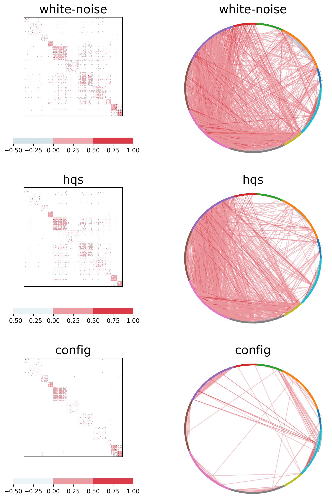
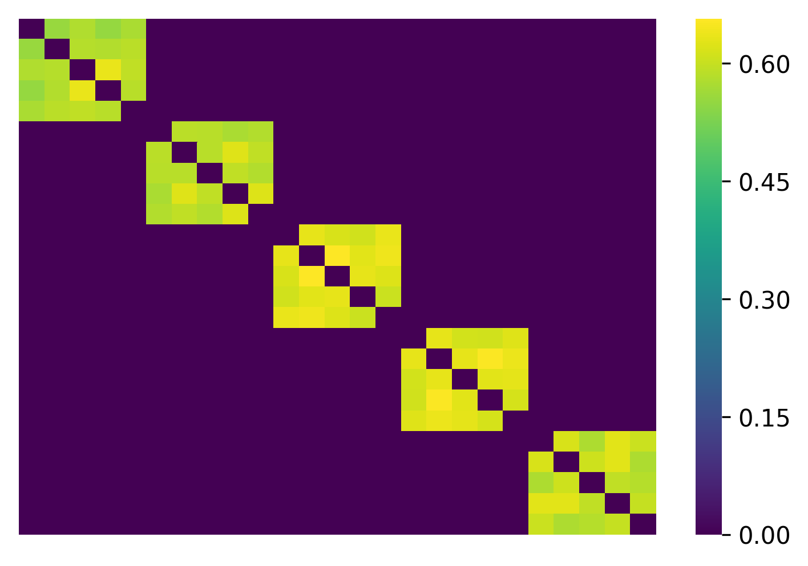

================================================
Constructing networks with different null models
================================================

With the Scola, two nodes are adjacent in the network if and only if the correlation between the nodes is considerably different from that in a null model.
In this example, we will show that diffferent null models will generate considerably different netwowkrs.

We use historic S&P 500 stock price data retrieved from Yahoo finance, `sp500-log-return.csv <https://raw.githubusercontent.com/skojaku/scola/master/data/sp500-log-return.csv>`_, which contains the log return of the prices of N=488 stocks between 2015/01/01 and 2019/01/01 (L=1,008 days). 
The code to retrieve the data can be found in `here <https://raw.githubusercontent.com/skojaku/scola/master/data/get_sp500_stock_prices.py>`.

First, download the toy data by 

.. code-block:: python

   import numpy as np
   import pandas as pd
   
   # Load the log return of the stock prices
   log_return = pd.read_csv("https://raw.githubusercontent.com/skojaku/scola/develop/data/sp500-log-return.csv", sep="\t")
   
   L = log_return.shape[0]
   N = log_return.shape[1]
   ticker_names = log_return.columns
   C_samp = log_return.corr().values

Let's see how the sample correlation matrix looks like:

.. code-block:: python
   
   import matplotlib.colors as colors
   import matplotlib.pyplot as plt
   import seaborn as sns
   
   def plot_corr(A, ax = None, dw = 0.125, cbar_length = .8):
   
       # Normalize colormap
       min_w = np.min(np.triu(A,1))
       max_w = np.max(np.triu(A,1))
       disc_min_w = dw * np.floor(min_w / dw)
       disc_max_w = dw * np.ceil(max_w / dw)
       bounds = np.linspace( disc_min_w, disc_max_w, np.round( (disc_max_w - disc_min_w) / dw) + 1 )
       norm = colors.BoundaryNorm(boundaries=bounds, ncolors=256)
       cmap = sns.diverging_palette(220, 10, as_cmap=True)
       
       # Draw heatmap
       ax = sns.heatmap(A, cmap=cmap,\
                        center = 0,\
                        vmax=max_w,\
                        vmin=min_w,\
                        square=True,\
                        mask=A==0,\
                        cbar_kws = dict(use_gridspec=False,location="bottom", shrink=cbar_length),\
                        norm=norm,\
                        ax = ax\
                       )
   
       ax.set_xticks([])
       ax.set_yticks([])
       
       # Draw frame
       ax.axhline(y=0, color='k',linewidth=2)
       ax.axhline(y=A.shape[1], color='k',linewidth=2)
       ax.axvline(x=0, color='k',linewidth=2)
       ax.axvline(x=A.shape[0], color='k',linewidth=2)
       
       return ax
   
   fig = plt.figure(figsize=(5, 5))
   ax = plt.gca()
   plot_corr(C_samp, ax = ax)

.. figure:: fig/C\_samp-sp500.png
   :scale: 40 %
   :align: center 

We generate networks with three different null models, i.e., white noise model, HQS [1] model and configuration model [2] (see null models for details).
We can specify the null model with argument ``null_model`` of scola.corr2net.transform, e.g., scola.corr2net.transform(C_samp, L, null_model ="white-noise").

We generate networks with the three null models:  

.. code-block:: python

   import scola

   null_models = ["white-noise", "hqs", "config"]
   Results = {}
   for null_model in null_models:
       W, C_null, selected_null_model, EBIC,construct_from, all_networks\
           = scola.corr2net.transform(C_samp, L, null_model = null_model)
       Results[null_model] = {"W":W, "EBIC":EBIC}

We show the adjacency matrices and the networks as follows. 

.. code-block:: python

   fig, axes = plt.subplots(nrows = 1, ncols = 3, figsize=(15, 5))
   for i, null_model in enumerate(null_models):
       W = Results[null_model]["W"]
       ax = plot_corr(W, ax=axes[i], dw=0.5)
       ax.set_title(null_model, fontsize = 20)
   plt.show()   

The three null models yield considerably different networks. 
In fact, for the networks generated by the white-noise model, one finds many edges between the stock prices of companies in different sectors (colour of nodes in circular plot).
The HQS model yields the network with fewer inter-sector edges. The configuration model yields the sparsest network with the smallest number of inter-section edges.  

See the :ref:`scola_package` for other return values.

Scola can construct a network from precision matrices, which is often different from that constructed from correlation matrices. 
To do this, give an extra parameter ``construct_from='pres'``: 

.. code-block:: python

   import scola
   W, C_null, selected_null_model, EBIC, construct_from, all_networks = scola.corr2net.transform(C_samp, L, construct_from="pres")

which produces a different network:

.. figure:: fig/Wpres.png
   :scale: 20 %
   :align: center 

If one sets ``construct_from='auto'``, the Scola constructs networks from correlation matrices and precision matrices. 
Then, it chooses the one that best represents the given data in terms of the extended BIC.
The selected type of the matrix is indicated by ``construct_from`` in the return variables. 
