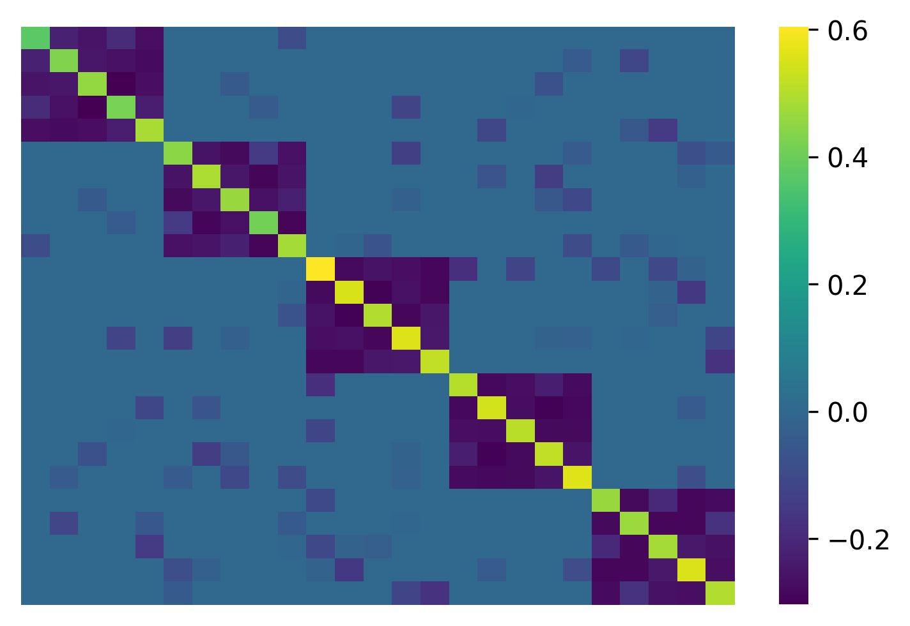

================================================
Constructing networks with different null models
================================================

With the Scola, two nodes are adjacent in the network if and only if the correlation between the nodes is considerably different from that in a null model.
In this example, we will show that diffferent null models will generate considerably different netwowkrs.

We use historic S&P 500 stock price data retrieved from Yahoo finance, `sp500-log-return.csv <https://raw.githubusercontent.com/skojaku/scola/master/data/sp500-log-return.csv>`_, which contains the log return of the prices of N=488 stocks between 2015/01/01 and 2019/01/01 (L=1,008 days). 
The code to retrieve the data can be found in `here <https://raw.githubusercontent.com/skojaku/scola/master/data/get_sp500_stock_prices.py>`.

First, download the toy data by 

.. code-block:: python

   import numpy as np
   import pandas as pd
   
   # Load the log return of the stock prices
   log_return = pd.read_csv("https://raw.githubusercontent.com/skojaku/scola/develop/data/sp500-log-return.csv", sep="\t")
   
   L = log_return.shape[0]
   N = log_return.shape[1]
   C_samp = log_return.corr().values

   # Ticker names
   ticker_names = pd.read_csv("https://raw.githubusercontent.com/skojaku/scola/develop/data/ticker-names.csv", sep="\t")

Let's see how the sample correlation matrix looks like:

.. code-block:: python
   
   import matplotlib.colors as colors
    
   def plot_corr(A, ax = None):
       
       min_w = np.min(A)
       max_w = np.max(A)
       disc_min_w = 0.125 * np.floor(min_w / 0.125)
       disc_max_w = 0.125 * np.ceil(max_w / 0.125)
       bounds = np.linspace( disc_min_w, disc_max_w, np.round( (disc_max_w - disc_min_w) / 0.125) + 1 )
       
       norm = colors.BoundaryNorm(boundaries=bounds, ncolors=256)
       cmap = sns.diverging_palette(220, 10, as_cmap=True)
       ax = sns.heatmap(A, cmap=cmap,\
                        center = 0,\
                        vmax=max_w,\
                        vmin=min_w,\
                        square=True,\
                        mask=A==0,\
                        norm=norm,\
                        ax = ax\
                       )
       
       ax.set_xticks([])
       ax.set_yticks([])
       return ax
  
   plot_corr(C_samp)

.. figure:: fig/C\_samp-sp500.png
   :scale: 20 %
   :align: center 

Finally, provide ``C_samp`` and ``L`` to estimate the network and associated null model: 

.. code-block:: python

   import scola
   W, C_null, selected_null_model, EBIC, construct_from, all_networks = scola.corr2net.transform(C_samp, L)

``W`` is the weighted adjacency matrix of the generated network, where 
W[i,j] indicates the weight of the edge between nodes i and j.

The ``W`` looks like

.. figure:: fig/W.png
   :scale: 20 %
   :align: center 

See the :ref:`scola_package` for other return values.

Scola can construct a network from precision matrices, which is often different from that constructed from correlation matrices. 
To do this, give an extra parameter ``construct_from='pres'``: 

.. code-block:: python

   import scola
   W, C_null, selected_null_model, EBIC, construct_from, all_networks = scola.corr2net.transform(C_samp, L, construct_from="pres")

which produces a different network:

If one sets ``construct_from='auto'``, the Scola constructs networks from correlation matrices and precision matrices. 
Then, it chooses the one that best represents the given data in terms of the extended BIC.
The selected type of the matrix is indicated by ``construct_from`` in the return variables. 
