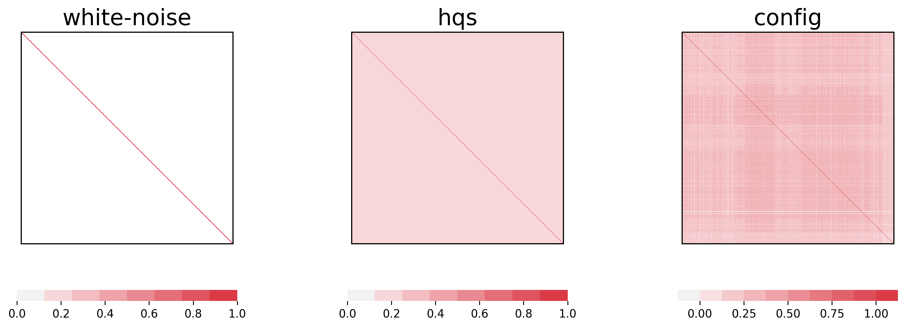

====================================
Null models for correlation networks
====================================

In empirical data, the nodes tend to be correlated with each other owing to trivial factors.
For example, in a time series of stock prices, global economic trends (e.g., recession and inflation) simultaneously affect different stock prices, that can lead to a large correlation between various pairs of stocks.
In this case, the thresholding approach may yield many spurious edges in the generated network. 

Scola filter out such spurious edges using a null model for correlation matrices that emulates spurious correlation of the data.
We will demonstrate how to generate randomised correlation matrices using the null model. 

We use the same data used in :ref:`Constructing_networks_with_different_null_models`.
Download the data and compute the sample correlation matrix following the instruction on the page.

scola.null_models package contains the functions to generate the null correlation matrices.
Three null models for correlation matrices are available in the scola package: White noise model, Hirschberger-Qi-Steuer (HQS) model [1], and the configuation model [2].

In the whise noise model, each node is independent of each other and has the same variance with that in the sample correlation matrix.
Therefore, the null correlation matrix for the white noise model is the identity matrix. 

In the Hirschberger-Qi-Steuer (HQS) model [1], each node pair is correlated to the same extent as expectation. 
The HQS model preserves the variance of the signal at each node averaged over all the nodes as expectation. 
Moreover, the HQS model preserves the average and variance of the correlation values over different pairs of nodes in the original correlation matrix as expectation. 
The HQS model is analogous to the Erdős-Rényi random graph for networks, in which each pair of nodes is adjacent with the same probability.

The configuration model [2] generate null correlation matrices that have the same row sum (or column sum) values with those for the sample correlation matrix.
Moreover, each node has the same variance with that in the sample correlation matrix.
The row sum of the correlation matrix is proportional to the correlation between individual node and the average over all nodes.
For example, in case for the stock prices, the configuration model preserves the correlation between individual stock prices and the average stock price in the market. 
The configuration model is analogous to the configuration model for networks, which preserves the row sum of the adjacency matrix (i.e., degree of each node).

